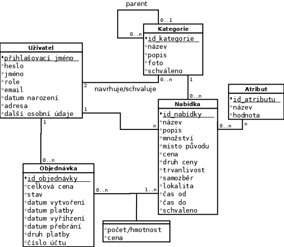
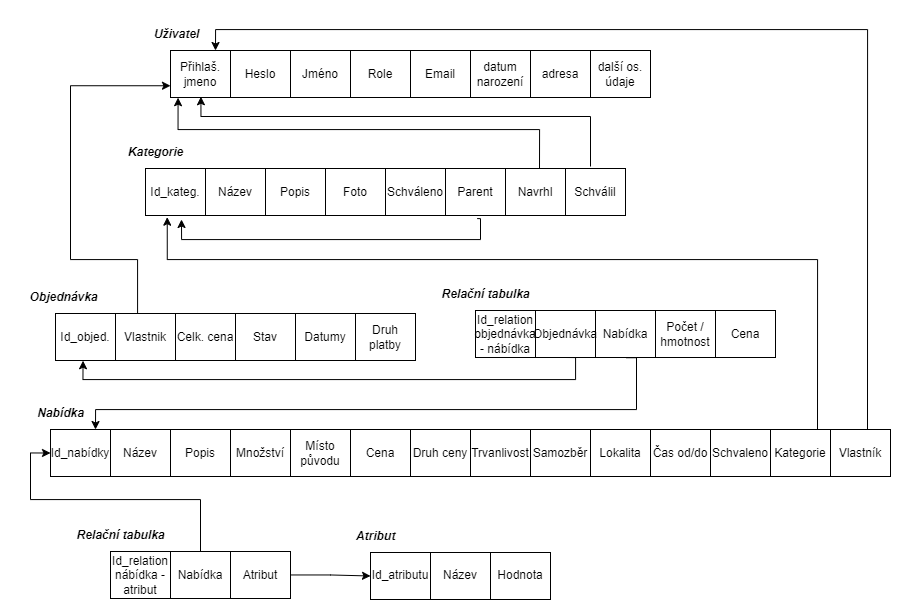
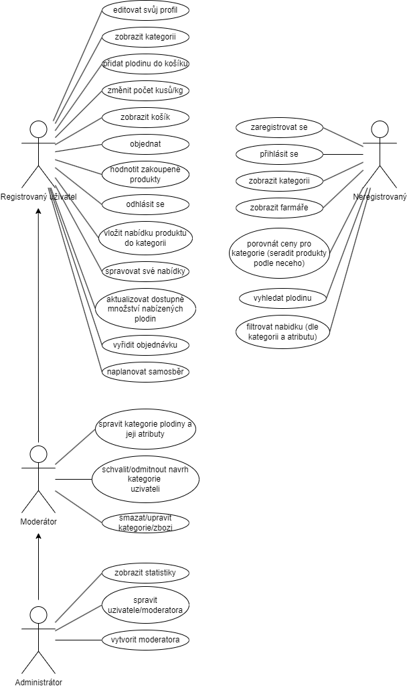

# IIS Project - Information system - Zelny trh

## Introduction 

This project is done as an assignment in subject of IIS at the University of Technology in Brno by its students.

Authors logins: xkozub09, xkrajc26, xkucer0v

TeamNick: Information_system_Experts

Date: 03.10.2024

## Work division

Written in dokumentation

## Team cooperation

Comunication channels:         Messenger, Discord
System for version managment:  git (running on Github)

## ER Diagram

## Model of Realation DB

## USE-CASE Diagram

